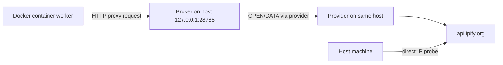

# M3 preflight proxy experiment report

Status: validated smoke baseline + local container IP parity check
Date: 2026-02-28

## What this means

We validated that the new reverse proxy path can be established and used end-to-end in CI.
Specifically, a worker-style HTTP request can authenticate to the broker, trigger a provider-side connect, and receive the expected upstream response through the broker tunnel.

## Experiment question

Can `swarm-proxy` establish a usable reverse path for worker egress without TURN/STUN, and does this run reliably in GitHub-hosted workers?

## Test artifacts

- Proxy implementation commit: `d97c696` (`Add swarm-proxy module and CLI for net_cap proxy mode`)
- CI workflow commit: `209b880` (`Add GitHub Actions smoke test for swarm-proxy`)
- Cleanup commit: `eeaf01f` (`Ignore local proxy smoke-test artifacts`)
- Workflow file: `.github/workflows/proxy-smoke.yml`
- Run 1: https://github.com/cybernetic-physics/swarm/actions/runs/22520237813
- Run 2: https://github.com/cybernetic-physics/swarm/actions/runs/22520261305
- Local IP parity artifact: `docs/artifacts/2026-02-28-ip-egress-validation.json`

## Network diagrams

### Topology diagram


### Connection sequence diagram


## What the workflow actually does

The `proxy-smoke` job runs on `ubuntu-latest` and performs:

1. Build `swarm-proxy`.
2. Start local upstream HTTP target on `127.0.0.1:19090` serving `ping.txt`.
3. Start broker on `127.0.0.1:18787`.
4. Generate ticket JSON (`--json ticket`) and extract `token`.
5. Start provider with the same `session_id` + `token`.
6. Execute proxied request:

```bash
curl -fsS \
  --proxy "http://127.0.0.1:18787" \
  --proxy-user "ci-session:${TOKEN}" \
  "http://127.0.0.1:19090/ping.txt" > proxied.txt
```

7. Validate payload equality with `diff -u` against expected `swarm-proxy-smoke-ok`.
8. If any step fails, upload `broker.log`, `provider.log`, and `http.log` as artifacts.

## Results

| Run id | Commit | Result | Timing (UTC) |
|---|---|---|---|
| 22520237813 | `209b880` | success | 2026-02-28 11:53:57 -> 11:54:18 |
| 22520261305 | `eeaf01f` | success | 2026-02-28 11:55:36 -> 11:56:01 |

Observed in both runs:
- `Build swarm-proxy`: success
- `End-to-end proxy smoke test`: success
- `Upload logs on failure`: skipped (expected because no failure)

## Final test: container egress IP parity with this machine

Question:
- Does a containerized worker request routed through `swarm-proxy` observe the same public egress IP as this machine?

Method:
1. Start local broker (`127.0.0.1:28788`) and provider (`swarm-proxy provider`).
2. Resolve this machine public IP from `https://api.ipify.org`.
3. From Docker container (`curlimages/curl:8.12.1`) query public IP directly.
4. From the same container query public IP through proxy:

```bash
curl -fsS \
  --proxy "http://host.docker.internal:28788" \
  --proxy-user "<session_id>:<token>" \
  https://api.ipify.org
```

5. Run negative control with wrong token and confirm broker rejects request (`403`).
6. Persist masked/hash-only results to `docs/artifacts/2026-02-28-ip-egress-validation.json`.

Local test network diagram:



Recorded result (`2026-02-28T12:04:04Z`):

| Check | Value |
|---|---|
| `host_public_ip_masked` | `98.97.27.x` |
| `container_direct_public_ip_masked` | `98.97.27.x` |
| `container_proxied_public_ip_masked` | `98.97.27.x` |
| `container_proxied_equals_host` | `true` |
| `container_direct_equals_host` | `true` |
| `proxy_wrong_token_http_status` | `403` |
| `proxy_wrong_token_check_passed` | `true` |

Conclusion:
- For this environment, the container's proxied egress IP matched this machine's public IP.
- Because direct container egress was also equal here, this test confirms proxy operation and auth gating but does not by itself demonstrate IP translation relative to a remote runner network.

## What was proven

- Broker/provider registration and auth token matching works for smoke-path traffic.
- Control-plane `OPEN` handshake and data-channel attach (`DATA`) complete correctly.
- HTTP forwarding path returns exact upstream payload through the tunnel.
- This path works in GitHub-hosted CI (not just local dev shell).
- Local Docker worker parity test shows proxied public IP equals host public IP in this environment.
- Wrong proxy token is rejected with `403`, confirming auth is enforced on the proxy path.

## What was not proven

- TURN/STUN traversal was not exercised and is not required for this proxy mode.
- No NAT-boundary, cross-host, or internet-path test was performed here.
- `CONNECT`/HTTPS tunneling behavior was not explicitly asserted in this workflow.
- No load/latency/soak behavior was measured.
- The local IP parity result does not prove remote GitHub runner egress rewriting to host IP.

## TURN/STUN answer for this experiment

For the current `swarm-proxy` broker/provider design, TURN/STUN is not part of the connection path. The provider makes outbound TCP to the broker and to the upstream target directly.

TURN/STUN is still relevant if we add a separate WebRTC transport mode (for example, a future `webrtc-tunnel` module). That would be a different substrate and requires separate validation.

## Recommended next experiments

1. Add a CI check for `CONNECT` tunnel semantics (HTTPS-style proxy behavior).
2. Run a cross-host test (provider and target on different hosts/subnets) to validate local-IP routing assumptions.
3. Add negative-path regressions: wrong token, missing provider, OPEN timeout, and provider disconnect during transfer.
